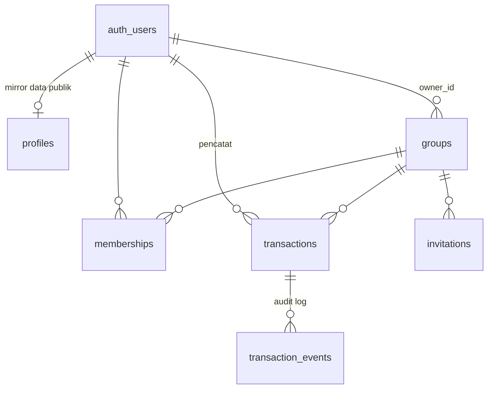

# Nabung Bareng — struktur database

Migrasi Supabase untuk v1. Dijalankan berurutan sesuai prefix timestamp.

| Berkas | Isi |
| --- | --- |
| `20260728120000_init_schema.sql` | Tabel, constraint, index |
| `20260728120100_functions_triggers.sql` | Helper, trigger penegak business rule, RPC undangan |
| `20260728120200_rls.sql` | Row Level Security |
| `20260728120300_views.sql` | View turunan (saldo, kontribusi, feed history) |
| `20260728120400_storage.sql` | Bucket `proofs` + policy-nya |

```bash
supabase db push
```

> **Belum diuji jalan.** Mesin ini tidak punya Postgres/Docker, jadi migrasi ini
> belum pernah dieksekusi — baru direview manual. Jalankan `supabase db reset`
> di lokal dulu sebelum push ke project remote.

---

## Bentuk data



Yang ditambahkan di luar draft skema, plus alasannya:

**`profiles`** — `auth.users` tidak bisa dibaca dari client, tapi tab Member dan
baris History butuh nama & avatar. Tabel ini mirror metadata Google Sign-In,
diisi trigger di `auth.users`, dan sengaja **read-only dari client**: kalau user
boleh mengubah `display_name`-nya sendiri, dia bisa menyamar sebagai member lain
di tab History. Fitur "ubah nama tampilan" perlu kolom `nickname` terpisah.

**`transaction_events`** — menggantikan kolom `edited_from`. Satu kolom hanya
menyimpan satu nilai lama, jadi edit kedua menghapus jejak edit pertama, dan
tidak mencatat siapa yang mengedit maupun kapan. Tabel append-only ini menampung
riwayat `created` / `approved` / `rejected` / `unapproved` / `amount_edited`.

**`reject_reason` di `transactions`** — spec mewajibkan alasan saat reject dan
wireframe menampilkannya inline di baris transaksi, tapi draft skema belum punya
kolomnya. Constraint memaksa kolom ini terisi persis saat status `rejected`.

**`proof_path`, bukan `proof_url`** — bucket `proofs` bersifat privat, jadi yang
disimpan adalah path objek. Client bikin signed URL saat mau menampilkan. Kalau
disimpan sebagai URL publik, siapa pun yang punya link bisa melihat bukti
transfer orang lain tanpa perlu jadi member.

**`invitations.expires_at`** — default 14 hari. Tanpa ini, link undangan berlaku
selamanya.

**`profiles.tier` + `tier_limits`** — belum ada di spec sama sekali; ditambah
untuk membatasi jumlah tabungan akun free (lihat bagian "Business rule" di
bawah). Tier murni flag manual: diubah lewat Supabase dashboard, bukan lewat
UI aplikasi — belum ada alur upgrade/downgrade atau payment gateway. Limit per
tier sengaja disimpan di tabel config `tier_limits`, bukan hardcode di trigger,
supaya bisa diubah (mis. free 3 → 5) cukup dengan UPDATE satu baris, tanpa
migration baru. `profiles.tier` mereferensi `tier_limits.tier` (bukan check
constraint terpisah) supaya menambah tier baru juga cukup lewat insert baris
config.

---

## Business rule yang dikunci di database

Frontend tidak perlu (dan tidak bisa) menentukan hal-hal ini:

| Aturan | Ditegakkan oleh |
| --- | --- |
| Deposit owner auto-verified, deposit member `pending` | trigger `transactions_before_insert` |
| Withdrawal hanya owner, selalu auto-verified | trigger + constraint `transactions_withdrawal_always_verified` |
| Withdrawal (baru maupun diedit) tidak boleh melebihi saldo pool | trigger `transactions_before_insert` + `transactions_guard_update` |
| Bukti wajib untuk semua jenis transaksi | `proof_path not null` |
| Catatan wajib untuk withdrawal, opsional untuk deposit | constraint `transactions_withdrawal_needs_note` |
| Reject wajib pakai alasan | constraint `transactions_reject_needs_reason` |
| Transisi status: `pending→verified`, `pending→rejected`, `verified→rejected` | trigger `transactions_guard_update` |
| `rejected` final — member upload ulang sebagai transaksi baru | tidak ada transisi keluar dari `rejected` |
| Edit nominal hanya oleh owner, hanya transaksinya sendiri | trigger `transactions_guard_update` |
| Ledger append-only (hard DELETE tetap diblokir) | trigger `transactions_block_delete`, tanpa policy DELETE |
| Hapus transaksi = soft delete (`deleted_at`), hanya owner, transaksi apa pun di grupnya | trigger `transactions_guard_update`; disaring dari `group_overview`/`member_contributions`/`transaction_feed` |
| Bukti harus file yang diunggah sendiri di folder grup itu | trigger `transactions_before_insert` |
| `created_at` ditentukan server (urutan History tidak bisa dipalsukan) | trigger `transactions_before_insert` |
| Field verifikasi hanya bergerak bersama perubahan status | trigger `transactions_guard_update` |
| Undangan hanya bisa dicabut, tidak bisa ditulis ulang | trigger `invitations_guard_update` |
| Single owner per grup | unique index `memberships_one_owner_per_group` |
| Kas (`ongoing`) tidak boleh punya target/deadline | constraint `groups_ongoing_has_no_goal` |
| `saldo = SUM(deposit verified) − SUM(withdrawal)` | view `group_overview` |
| Kontribusi gross, tidak berkurang oleh withdrawal | view `member_contributions` |
| Akun free maksimal punya N tabungan aktif (N dari config `tier_limits`, saat ini 3); premium tidak dibatasi | trigger `groups_check_tier_limit` |

`user_id` transaksi, `owner_id` grup, dan `invited_by` undangan selalu diambil
dari `auth.uid()` di trigger, bukan dari payload client — jadi tidak bisa
dipalsukan lewat REST API.

---

## Cara frontend memakainya

Baca lewat view, jangan hitung saldo sendiri:

```js
// Home
supabase.from('group_overview').select('*')

// Detail — header
supabase.from('group_overview').select('*').eq('group_id', id).single()

// Detail — tab History
supabase.from('transaction_feed').select('*')
  .eq('group_id', id).order('created_at', { ascending: false })

// Detail — tab Member
supabase.from('member_contributions').select('*')
  .eq('group_id', id).order('total_contributed', { ascending: false })
```

Alur upload bukti (layar 6) — file dulu, transaksi kemudian:

```js
const path = `${groupId}/${userId}/${crypto.randomUUID()}.jpg`
await supabase.storage.from('proofs').upload(path, file)
await supabase.from('transactions').insert({
  group_id: groupId, type: 'deposit', amount, note, proof_path: path,
})
// status tidak dikirim — server yang menentukan pending vs verified
```

Menampilkan bukti:

```js
const { data } = await supabase.storage.from('proofs')
  .createSignedUrl(tx.proof_path, 60)
```

Alur undangan (layar 7a/7b) — lewat RPC, bukan query tabel:

```js
// Sebelum login pun bisa: layar 7b butuh nama grup & nama pengundang
const { data } = await supabase.rpc('get_invitation_preview', { p_token: token })
// data.state: 'ok' | 'not_found' | 'expired' | 'used' | 'revoked' | 'already_member'
// Token salah/terpotong mengembalikan state 'not_found', bukan HTTP error —
// jadi layar 7b bisa menampilkan pesan yang ramah.

// Setelah user tekan "Gabung"
const { data: groupId } = await supabase.rpc('accept_invitation', { p_token: token })
```

Tabel `invitations` sengaja tidak diberi akses SELECT ke penerima undangan —
kalau diberi, token orang lain bisa dienumerasi lewat REST API.

---

## Yang belum diputuskan

Lima hal ini butuh keputusanmu, bukan sesuatu yang bisa aku ambil dari spec:

**1. Link undangan sekali pakai atau bisa dipakai berkali-kali?**
Draft skema (`status in ('pending','accepted')` + token unique) menyiratkan
sekali pakai, dan itu yang aku implementasi. Tapi kalau kebiasaannya owner
share satu link ke grup WhatsApp lalu beberapa orang join dari link yang sama,
model ini salah — orang kedua akan dapat error "undangan sudah dipakai". Versi
multi-pakai butuh `max_uses` (atau tanpa batas) dan `invitation_uses` terpisah,
bukan `accepted_by` tunggal.

**2. ~~Boleh withdrawal melebihi saldo?~~ — Sudah diputuskan: tidak boleh.**
Ditutup lewat migrasi `20260729083133_limit_withdrawal_to_balance.sql`.
`tg_transactions_before_insert` menolak withdrawal baru yang nominalnya lebih
besar dari `SUM(deposit verified) - SUM(withdrawal verified)` grup itu, dan
`tg_transactions_guard_update` menerapkan batas yang sama saat owner mengedit
nominal withdrawal yang sudah ada (dengan `old.amount` ditambahkan kembali ke
saldo pembanding, karena baris itu sendiri masih ikut terhitung sampai UPDATE
commit). Diuji ke database sungguhan: melebihi saldo ditolak, tepat sama
dengan saldo (boundary) diizinkan, dan edit nominal ke atas tetap tunduk batas
yang sama.

**3. Member boleh edit nominal transaksinya sendiri?**
Spec menaruh "edit nominal transaksi miliknya sendiri" hanya di bawah **Aksi
Owner**, jadi aku kunci: harus owner *dan* harus transaksinya sendiri. Efeknya,
member yang salah ketik nominal tidak bisa memperbaiki — dia harus menunggu
di-reject lalu upload ulang. Itu memang bisa jadi memang yang kamu maksud
(reject sudah jadi jalur koreksinya), tapi worth dikonfirmasi.

**4. Hapus grup dan keluarkan member.**
Keduanya belum ada di spec, dan aku sengaja tidak membuka policy DELETE-nya —
masing-masing punya jebakan. Hapus grup bertabrakan dengan ledger append-only
(cascade ke `transactions` akan ditolak trigger). Menghapus baris membership
membuat transaksi orang itu tetap dihitung ke saldo pool tapi hilang dari tab
Member, sehingga jumlah kontribusi tidak lagi cocok dengan saldo. Solusi yang
biasanya benar untuk keduanya adalah soft-delete/arsip (`archived_at`), tapi itu
menambah state baru ke UI.

**5. Penghapusan akun.**
`transactions.user_id`, `groups.owner_id`, dan `transaction_events.actor_id`
menunjuk ke `auth.users` tanpa ON DELETE. Efeknya, user yang pernah bertransaksi
**tidak bisa dihapus** — `auth.admin.deleteUser()` akan gagal dengan pelanggaran
foreign key. Itu bukan kelalaian: `cascade` akan menghapus baris ledger (saldo
grup ikut berubah tanpa jejak), dan `set null` melanggar constraint NOT NULL.
Kalau penghapusan akun perlu didukung — dan untuk permintaan hapus data pribadi
biasanya iya — jalurnya adalah menandai user sebagai tombstone (anonimkan
`profiles`, biarkan baris ledger utuh), bukan DELETE.

Selain itu, `memberships.status = 'invited'` praktis tidak terpakai di v1: alur
link membuat baris langsung `active` saat token ditukar, karena sebelum itu kita
belum tahu siapa yang akan join. Kolomnya aku pertahankan untuk undangan
per-email di v2.
